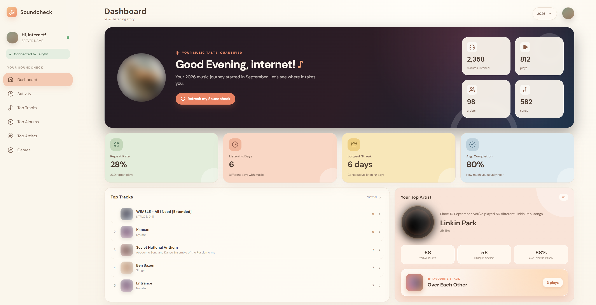
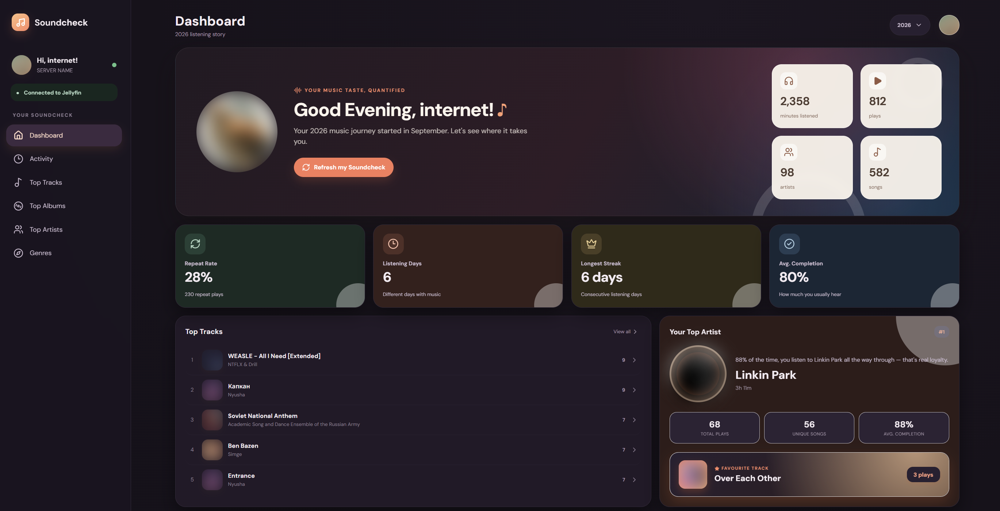
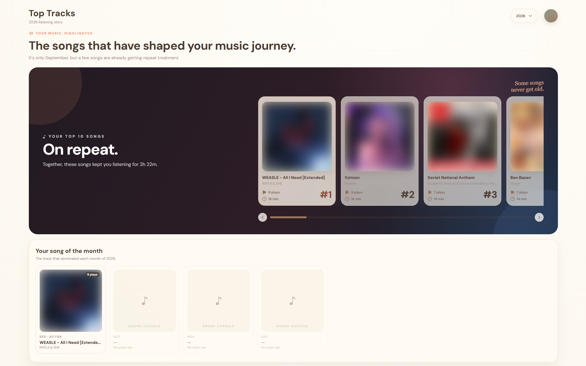
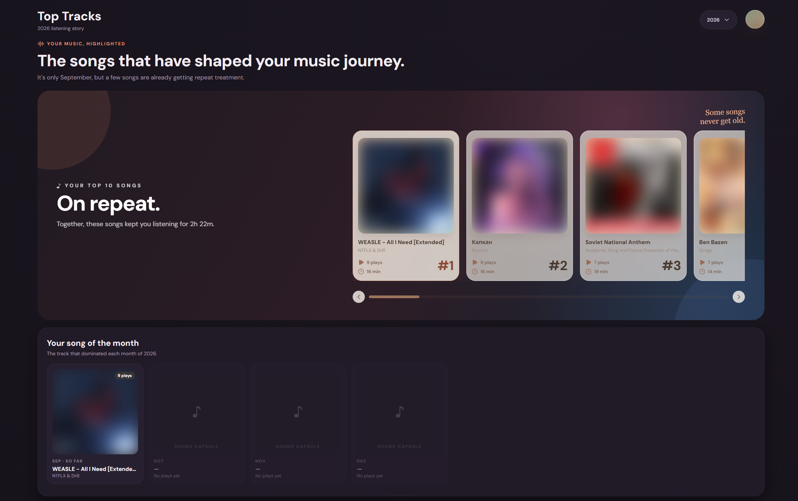
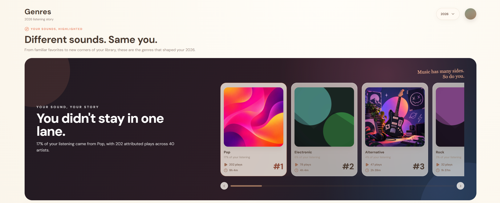
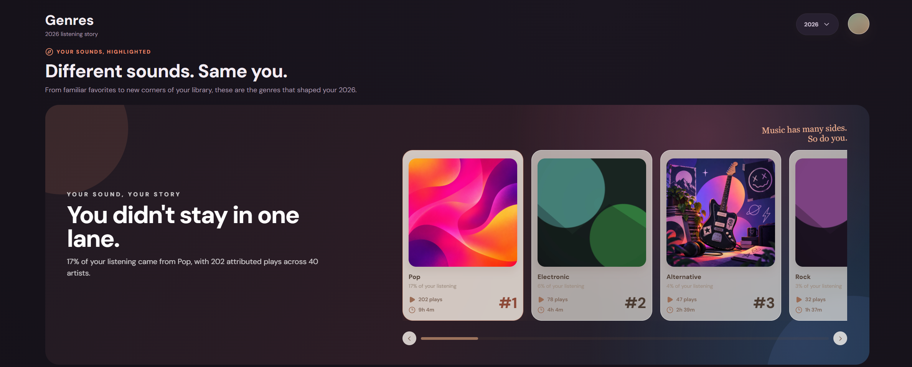

# Soundcheck

*Your music taste, quantified*

A year-in-review listening recap for your own
**Jellyfin** server — self-hosted, database-first, and built to go a lot
deeper than a top-5 list.

> **Beta.** Soundcheck is feature-complete and in daily use, but still young.
> Please [report anything that looks wrong](https://github.com/samternet/soundcheck/issues).
>
> **AI-assisted.** Parts of the code, documentation and genre artwork were created
> with the help of AI models, and reviewed and tested by the maintainer.
>
> **Unofficial project.** Soundcheck is a community project and is
> not affiliated with or endorsed by the Jellyfin project. "Jellyfin" is a
> trademark of its respective owners.

<p align="center">
  
  
</p>
<p align="center"><sub>Light mode · Dark mode</sub></p>


## What it is

Soundcheck connects to your Jellyfin server, quietly tracks
listening in the background, and turns that history into a detailed,
personal dashboard: top tracks/artists/albums, a genre breakdown with a
diversity score, a listening-activity view with an hour-of-day chart, a
weekly pattern radar, and a full year-at-a-glance calendar heatmap — plus
per-item detail popups (song, artist, album, genre) with real stats and a
direct link back into Jellyfin.

It's built for a household or small community server: one administrator
connects the server once, and everyone else on that server gets their own
private dashboard scoped to their own listening — no per-user setup
required beyond signing in.

## What it isn't

Soundcheck deliberately does **not** use Jellyfin Webhooks, a
Server-Sent-Events plugin, a browser live-playback stream, or the Playback
Reporting plugin. It uses a single, boring, reliable mechanism instead:
polling Jellyfin's standard `/Sessions` API every few seconds. That
trade-off means Soundcheck favors **correct historical statistics over
real-time playback display**, and it means the only thing Soundcheck
needs from your Jellyfin server is an admin login — no plugins to install,
nothing else to keep in sync.

One real limitation follows from this: Jellyfin doesn't expose a
reconstructable per-play history, so Soundcheck can only start building
detailed statistics from the moment tracking is enabled. Your existing
Jellyfin play counts can't be converted into a backdated timeline.

## Features

**Dashboard** — total minutes/plays/artists/songs, repeat rate, listening
days, streaks, average completion, your top artist/album/genre, a monthly
listening chart, a listening-personality read, and a peak-listening-hour
summary.

**Top Tracks / Artists / Albums** — a highlighted top 5–10 plus a
searchable, sortable table of the rest, each item opening a detail popup
with plays, listening time, monthly activity, and (for songs) skip rate,
completions, and Jellyfin-synced favoriting.

**Genres** — a top-five genre hero, a four-axis "sound profile" (discovery,
repeat, variety, consistency), a genre-rank timeline over the year, a
diversity score, and time-of-day genre patterns.

**Activity** — an hour-of-day polar chart, a day-of-week radar, a full
year calendar heatmap, current/longest streaks, average/longest session
length, and your 10 most recently played tracks.

**Works from anywhere you actually are** — three-bucket URL resolution
means "Open in Jellyfin" links resolve correctly whether you're on the
same local network, on Tailscale, or reaching Soundcheck through a
public domain, without you having to think about it.

**Multi-user, one admin setup** — the first login to a new server must be
a Jellyfin administrator, who connects the server once; the background
tracker then records listening for every Jellyfin user on that server,
even ones who've never opened Soundcheck. Each user only ever sees
their own statistics, and their password is never stored.

## Screenshots

### Top Tracks

<p align="center">
  
  
</p>
<p align="center"><sub>Light mode · Dark mode</sub></p>

### Genres

<p align="center">
  
  
</p>
<p align="center"><sub>Light mode · Dark mode</sub></p>

<sub>Click any screenshot to see it full size. Album artwork and artist photos
are blurred because they belong to their respective rights holders; in the app
you'll see your own library's artwork.</sub>

## Quick start

You need a running Jellyfin server and Docker.

```bash
git clone https://github.com/samternet/soundcheck.git
cd soundcheck
cp .env.example .env
```

Open `.env` and set `TZ` to your timezone (for example `TZ=Asia/Kolkata` for
India). Soundcheck won't start until it's set, because it decides where each
day of your listening begins. Then start it:

```bash
docker compose up -d --build
```

Open `http://localhost:7096`. The first person to sign in **must be a
Jellyfin administrator** — that one-time login is what connects Soundcheck
to your server and starts the background tracker. After that,
anyone else on the server can sign in with their own Jellyfin username and
password and get their own dashboard.

## Configuration

Settings live in a `.env` file next to `docker-compose.yml`. Copy
`.env.example` to `.env` to get one with every setting explained. After changing
it, run `docker compose up -d` to apply.

| Variable | Default | Purpose |
|---|---|---|
| `TZ` | **required** | Timezone for daily and monthly statistics, as an IANA name such as `Asia/Kolkata`, `Europe/London` or `America/New_York`. Abbreviations like `IST` aren't reliable because several countries share them. |
| `SOUNDCHECK_PORT` | `7096` | Port Soundcheck is served on. |
| `JELLYFIN_URL` | *(empty)* | Pre-fills the server address on the very first admin setup screen only. Has no effect once a server is connected. |
| `JELLYFIN_PUBLIC_URL` | *(empty)* | Your Jellyfin server's public domain (e.g. `https://jellyfin.example.com`), used only to build "Open in Jellyfin" links when Soundcheck is accessed from outside your local network. Can also be set later from Admin Settings. |
| `JELLYFIN_TAILSCALE_URL` | *(empty)* | Same idea, for when Soundcheck is accessed over Tailscale (e.g. `http://100.x.x.x:8096`). Falls back to `JELLYFIN_PUBLIC_URL`, then the local address, if unset. |

None of these affect how Soundcheck talks to Jellyfin in the
background — that always uses the address given at the initial admin login.

## How tracking works

```text
Jellyfin server
     │
     │ standard /Sessions API, polled every 5 seconds
     ▼
Soundcheck background tracker
     │
     ├── SQLite: open playback state
     │
     └── SQLite: finalized play_events
              │
              ▼
        Your dashboard
```

The tracker treats each `/Sessions` response as one coherent snapshot —
item, title, artist, album, duration, position, pause state, device, and
client are all processed together. A play is finalized (written
permanently) when it ends, switches tracks, or repeats; in-progress
playback lives in SQLite too, so it survives an API restart without being
lost or double-counted. Pause time and seek jumps are excluded from
listened time.

## Data & privacy

- Your Jellyfin **password is never stored**, by anyone, ever.
- The connecting administrator's Jellyfin **access token is encrypted**
  (AES-256-GCM) before being stored in SQLite, using a secret generated
  once per install (`/data/.soundcheck-secret` inside the container, or set
  it yourself via the `SOUNDCHECK_SECRET` environment variable).
- Everything Soundcheck knows about your listening lives in one SQLite
  database inside the `soundcheck-data` Docker volume — nothing is sent
  anywhere else.
- Each login also gets its own Jellyfin device identity, so signing in
  from a second browser or network never invalidates a session you already
  have open elsewhere.

## Project structure

```
src/            React frontend (see CONTRIBUTING.md for the full layout)
server/src/     Express API, SQLite schema, and the background tracker
public/         Static assets, including the bundled genre artwork
docs/images/    Screenshots used in this README
docker-compose.yml
```

See [CONTRIBUTING.md](CONTRIBUTING.md) if you want to run this locally
outside Docker, or contribute a change.

## Roadmap

- **Monthly / yearly recap exports** — polished, shareable recap images
  (Instagram-Story-style) generated on demand, gated behind a minimum of
  two months of tracked history so an export never feels empty.
- See open issues for everything else currently planned.

## License

[GNU AGPL-3.0](LICENSE). Contributions are welcome — see
[CONTRIBUTING.md](CONTRIBUTING.md).

## Full history

The complete version-by-version history is in [CHANGELOG.md](CHANGELOG.md).
